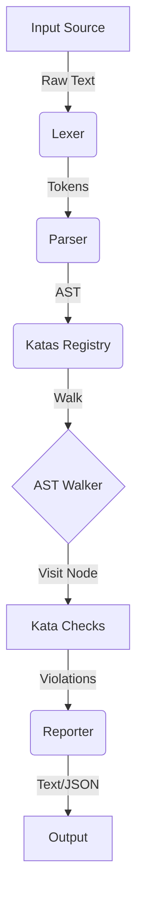

# ZShellCheck Architecture

This document provides a high-level overview of the ZShellCheck architecture, detailing how the tool processes Zsh scripts from raw text to reported violations.

## High-Level Pipeline

ZShellCheck follows a standard static analysis pipeline:

## Core Components

### 1. Lexer (`pkg/lexer`)
The **Lexer** scans the input source code and converts it into a stream of **Tokens**.
- Handles Zsh-specific quoting rules, expansions (`${...}`), and command substitutions (`$(...)`).
- **Input:** `string` (file content)
- **Output:** `[]Token`

### 2. Parser (`pkg/parser`)
The **Parser** consumes the stream of tokens and builds an **Abstract Syntax Tree (AST)**.
- Implements a recursive descent parser.
- Handles complex Zsh structures like `if`, `for`, `while`, functions, and arithmetic expressions.
- **Input:** `[]Token`
- **Output:** `ast.Program` (Root Node)

### 3. AST (`pkg/ast`)
The **AST** defines the structure of the Zsh script in a tree format.
- **Nodes:** Implement the `Node` interface (`TokenLiteral()`, `String()`).
- **Types:** `SimpleCommand`, `IfStatement`, `ForLoop`, `ArrayExpression`, etc.

### 4. Katas (`pkg/katas`)
**Katas** are the individual check rules.
- **Registry:** Manages all available Katas.
- **Registration:** Katas register themselves to listen for specific AST Node types (e.g., `ast.SimpleCommandNode`).
- **Check Logic:** Each Kata inspects a node and returns a list of `Violation`s if issues are found.

### 5. Walker (Internal)
The walker traverses the AST depth-first. For each node visited, it queries the **Registry** for Katas listening to that specific node type and executes them.

### 6. Reporter (`pkg/reporter`)
The **Reporter** formats the collected violations into user-friendly output.
- **TextReporter:** Standard CLI output with colors.
- **JSONReporter:** Structured output for CI/CD integrations.

## Directory Structure

| Directory | Description |
| :--- | :--- |
| `cmd/zshellcheck` | Main entry point of the application. |
| `pkg/ast` | AST node definitions and interfaces. |
| `pkg/lexer` | Tokenizer logic. |
| `pkg/parser` | Syntactic analysis and tree construction. |
| `pkg/token` | Token definitions. |
| `pkg/katas` | Implementation of individual checks (Katas). |
| `pkg/reporter` | Output formatting logic. |
| `tests` | Integration tests. |

## Adding a New Feature

To add a new check (Kata):
1.  Identify the target AST node type (e.g., `SimpleCommand` for checking command names).
2.  Create a new file in `pkg/katas/` (e.g., `zc9000.go`).
3.  Implement the check logic.
4.  Register the Kata in `init()`.
5.  Add tests in `pkg/katas/katatests/`.
