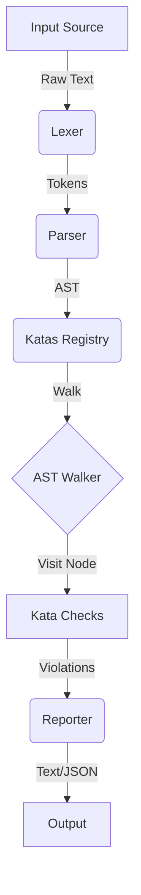

# Developer Guide

This document serves as the comprehensive manual for contributing to the ZShellCheck codebase, understanding its internal architecture, and managing the release lifecycle.

## Table of Contents

- [Getting Started](#getting-started)
- [Development Workflow](#development-workflow)
- [Architecture Overview](#architecture-overview)
- [AST Reference](#ast-reference)
- [Release Process](#release-process)
- [Project Governance](#project-governance)

---

## Getting Started

### Prerequisites

- **Go**: Version 1.18 or higher.
- **Git**: For version control.
- **Make** (Optional): For running build scripts if available.

### Setup

1.  **Clone the repository:**
    ```bash
    git clone https://github.com/afadesigns/zshellcheck.git
    cd zshellcheck
    ```

2.  **Install dependencies:**
    ```bash
    go mod download
    ```

## Development Workflow

### Building

To build the project from source:

```bash
go build -o zshellcheck cmd/zshellcheck/main.go
```

### Running Tests

We use the standard Go testing framework.

- **Run all tests:**
  ```bash
  go test ./...
  ```

- **Run specific tests:**
  ```bash
  go test -v pkg/parser/parser_test.go
  ```

- **Integration Tests:**
  Run against real Zsh scripts.
  ```bash
  ./tests/integration_test.zsh
  ```

### Creating a New Kata

1.  **Identify the Anti-Pattern**: What Zsh issue do you want to catch?
2.  **Determine the AST Node**: Use the [AST Reference](#ast-reference) below to find the relevant node type.
3.  **Create the File**: Add `pkg/katas/zcXXXX.go` (next available ID).
4.  **Implement**:
    ```go
    package katas
    import "github.com/afadesigns/zshellcheck/pkg/ast"

    func init() {
        RegisterKata(ast.SimpleCommandNode, Kata{
            ID: "ZCXXXX",
            Title: "Title of your check",
            Description: "Description of what is wrong.",
            Check: checkZCXXXX,
        })
    }

    func checkZCXXXX(node ast.Node) []Violation {
        // Cast node to specific type
        cmd := node.(*ast.SimpleCommand)
        // Check logic...
        return nil
    }
    ```
5.  **Test**: Add `pkg/katas/katatests/zcXXXX_test.go` with test cases.

---

## Architecture Overview

ZShellCheck follows a standard static analysis pipeline:



### Core Components

1.  **Lexer (`pkg/lexer`)**: Scans source code into a stream of **Tokens**. Handles Zsh-specific quoting and expansions.
2.  **Parser (`pkg/parser`)**: Consumes tokens to build an **Abstract Syntax Tree (AST)**. Implements a recursive descent parser.
3.  **AST (`pkg/ast`)**: Defines the tree structure (Nodes, Statements, Expressions).
4.  **Katas (`pkg/katas`)**: The check rules. Each Kata registers to listen for specific AST Node types.
5.  **Reporter (`pkg/reporter`)**: Formats violations into Text or JSON output.

---

## AST Reference

Understanding AST nodes is crucial for writing Katas.

### Common Node Types

-   **`SimpleCommandNode`**: Basic command execution (e.g., `ls -la`).
    -   Fields: `Name` (Expression), `Arguments` ([]Expression).
-   **`IfStatementNode`**: `if` control structure.
    -   Fields: `Condition`, `Consequence`, `Alternative` (BlockStatements).
-   **`ForLoopStatementNode`**: `for` loops (C-style and for-each).
    -   Fields: `Init`, `Condition`, `Post`, `Items`, `Body`.
-   **`CommandSubstitutionNode`**: Backticks `` `...` ``.
-   **`DollarParenExpressionNode`**: `$(...)`.
-   **`ArithmeticCommandNode`**: `(( ... ))`.
-   **`BracketExpressionNode`**: `[ ... ]`.
-   **`DoubleBracketExpressionNode`**: `[[ ... ]]`.

### Visitor Pattern

Use `ast.Walk` to traverse the tree:

```go
ast.Walk(rootNode, func(node ast.Node) bool {
    if cmd, ok := node.(*ast.SimpleCommand); ok {
        // Inspect command...
    }
    return true // Continue traversal
})
```

---

## Release Process

Releases are automated via [GoReleaser](https://goreleaser.com/).

1.  **Prepare**: Update `CHANGELOG.md`.
2.  **Tag**: Push a semantic version tag (e.g., `v0.0.80`).
    ```bash
    git tag v0.0.80
    git push origin v0.0.80
    ```
3.  **Build**: GitHub Actions will detect the tag, run tests, build binaries, and publish a GitHub Release.

---

## Project Governance

See [REFERENCE.md](REFERENCE.md) for details on roles and decision making.